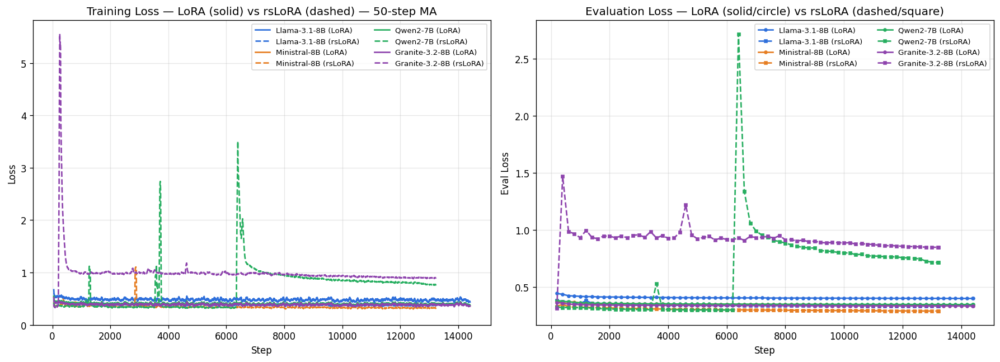

# LoRA vs rsLoRA on Job-Shop Scheduling with Small Open-Weight LLMs

[](https://huggingface.co/datasets/henri24/Starjob)

This repository fine-tunes four small/medium open-weight LLMs on the Job-Shop Scheduling Problem (JSSP) using two adapter strategies — **LoRA** and **rsLoRA** (rank-stabilized LoRA) — and evaluates them head-to-head with an identical pipeline (same data, same seed, same feasibility validator).

The dataset comes from [Starjob](https://huggingface.co/datasets/henri24/Starjob).

---

## Experiment

### Goal

Find which low-rank adapter method (LoRA vs rsLoRA) yields more *feasible* and *closer-to-optimal* JSSP schedules across multiple base models, when everything else is held fixed.

### Models

| Model | Base | Quantization |
|---|---|---|
| LLaMA 3.1 8B | `unsloth/Meta-Llama-3.1-8B-Instruct-bnb-4bit` | bnb 4-bit |
| Granite 3.2 8B | `unsloth/granite-3.2-8b-instruct-bnb-4bit` | bnb 4-bit |
| Ministral 8B | `mistralai/Ministral-8B-Instruct-2410` | bnb 4-bit |
| Qwen2 7B | `unsloth/Qwen2-7B-Instruct-bnb-4bit` | bnb 4-bit |

### Training configuration (identical for both methods)

| Hyperparameter | Value |
|---|---|
| LoRA rank `r` | 32 |
| LoRA alpha | 32 |
| Max sequence length | 8192 |
| Batch size (per device) | 1 |
| Gradient accumulation | 8 |
| Effective batch | 8 |
| Epochs | 1 |
| Learning rate | 2e-4 |
| Optimizer | (Unsloth default) AdamW 8-bit |
| `use_rslora` | `False` (LoRA) / `True` (rsLoRA) |

The same `train_<model>.py` script is used for both — pass `--use_rslora False` for plain LoRA.

### Evaluation protocol

| Setting | Value |
|---|---|
| Eval set | `data/starjob_train_sm.jsonl` (small + medium JSSP instances) |
| Sample count | 200 (random, seed = 42) |
| Generation | `temperature=0.1`, `top_p=0.95`, `max_new_tokens=4096` |
| Feasibility check | routing order + machine non-overlap + complete operations |
| Metrics | feasibility %, exact-makespan %, mean / median gap vs. ground truth |

The same `eval_lora.py` and `eval_rslora.py` mirror each other exactly so the results are head-to-head comparable.

---

## Results

Side-by-side training and evaluation loss for all 4 models × 2 methods (solid = LoRA, dashed = rsLoRA, same color = same model):



### Head-to-head metrics (n = 200, identical pipeline)

| Method | Model | Time | Feasible | Exact | Mean gap | Median gap |
|---|---|---:|---:|---:|---:|---:|
| **LoRA** | LLaMA 3.1 8B | 21.5 min | **96.5%** | **34.5%** | **6.88%** | **3.47%** |
| rsLoRA | LLaMA 3.1 8B | 24.2 min | 95.0% | 32.0% | 9.80% | 5.29% |
| **LoRA** | Granite 3.2 8B | 134.9 min | **86.5%** | **33.5%** | **56.15%** | **4.76%** |
| rsLoRA | Granite 3.2 8B | 147.9 min | 24.5% | 5.5% | 215.27% | 41.42% |
| **LoRA** | Ministral 8B | 93.8 min | **95.0%** | **32.0%** | **15.67%** | **4.91%** |
| rsLoRA | Ministral 8B | 118.9 min | 64.0% | 24.5% | 42.93% | 9.25% |
| LoRA | Qwen2 7B | 38.6 min | 1.0% | 3.0% | 56.30% | 28.29% |
| **rsLoRA** | Qwen2 7B | 31.8 min | **50.0%** | **27.5%** | **27.81%** | **9.37%** |

Bold = winner per (model, metric). Full structured numbers: [`comparison_lora_vs_rslora.json`](comparison_lora_vs_rslora.json).

### Model Weights

All 8 adapters (~321–402 MB each) are published on Hugging Face. Load with `peft.PeftModel.from_pretrained(base, repo_id)`.

| Base model | LoRA | rsLoRA |
|---|---|---|
| Llama-3.1-8B-Instruct  | [`tiodh/llama3.1-8b-jssp-lora`](https://huggingface.co/tiodh/llama3.1-8b-jssp-lora)   | [`tiodh/llama3.1-8b-jssp-rslora`](https://huggingface.co/tiodh/llama3.1-8b-jssp-rslora) |
| Granite-3.2-8B-Instruct | [`tiodh/granite3.2-8b-jssp-lora`](https://huggingface.co/tiodh/granite3.2-8b-jssp-lora) | [`tiodh/granite3.2-8b-jssp-rslora`](https://huggingface.co/tiodh/granite3.2-8b-jssp-rslora) |
| Ministral-8B-Instruct-2410 | [`tiodh/ministral-8b-jssp-lora`](https://huggingface.co/tiodh/ministral-8b-jssp-lora) | [`tiodh/ministral-8b-jssp-rslora`](https://huggingface.co/tiodh/ministral-8b-jssp-rslora) |
| Qwen2-7B-Instruct | [`tiodh/qwen2-7b-jssp-lora`](https://huggingface.co/tiodh/qwen2-7b-jssp-lora) | [`tiodh/qwen2-7b-jssp-rslora`](https://huggingface.co/tiodh/qwen2-7b-jssp-rslora) |

```python
from peft import PeftModel
from transformers import AutoModelForCausalLM, AutoTokenizer

base = AutoModelForCausalLM.from_pretrained(
    "meta-llama/Meta-Llama-3.1-8B-Instruct",
    device_map="auto", torch_dtype="auto",
)
tok = AutoTokenizer.from_pretrained("meta-llama/Meta-Llama-3.1-8B-Instruct")
model = PeftModel.from_pretrained(base, "tiodh/llama3.1-8b-jssp-lora")
```

### Findings

- **LoRA wins on 3 of 4 models** (LLaMA, Granite, Ministral) on every metric — feasibility, exactness, and gap.
- **Granite + rsLoRA fails to converge** within 1 epoch (24.5% feasibility, 215% mean gap). The LoRA variant of the same model trains cleanly to 86.5% feasibility.
- **Qwen2 + LoRA collapses** (1% feasibility) while Qwen2 + rsLoRA reaches 50%. The Qwen2 LoRA learning curve does not show divergence; the failure is at generation time on larger problem sizes (the per-size breakdown in `metrics_lora_qwen2.json` shows 970% mean gap on 10×9 instances).

---

## Reproducibility

### Setup

```bash
python3 -m venv venv
source venv/bin/activate          # Linux/macOS
pip install -r requirements.txt
```

### Train

```bash
# rsLoRA (default)
python train_llama_3.py
python train_granite_8b.py
python train_ministral_8b.py
python train_qwen2_7b.py

# Plain LoRA
python train_llama_3.py --use_rslora False
# ...etc.
```

### Evaluate

```bash
./run_eval_lora.sh      # all 4 LoRA models
./run_eval_rslora.sh    # all 4 rsLoRA models
```

### Plot

```bash
python plot_learning_curves.py             # LoRA-only
python plot_learning_curves_rslora.py      # rsLoRA-only
python plot_learning_curves_combined.py    # merged + long-form CSV
```

---

## Project Structure

Files grouped by objective.

### Data

- `prepare_dataset.py` — Build train/test splits from raw Starjob.
- `sample_output.py` — Inspect sample model outputs.
- `data/starjob_train_sm.jsonl` — Small+medium training/eval split (LFS-tracked).

### Training (shared LoRA / rsLoRA)

Source code (`--use_rslora` flag, default `True`):
- `train_llama_3.py`, `train_granite_8b.py`, `train_ministral_8b.py`, `train_qwen2_7b.py`
- `run_qwen_granite.sh`, `run_granite_autoresume.sh`

Output checkpoints (gitignored):
- LoRA: `output_alpha32_r32_seq8192_b1_ga8_ep1/`, `output_granite8b_alpha32_r32_seq8192_b1_ga8_ep1/`, `output_ministral8b_alpha32_r32_seq8192_b1_ga8_ep1/`, `output_qwen2_7b_alpha32_r32_seq8192_b1_ga8_ep1/`
- rsLoRA: `output_*_rslora_*/`

### LoRA Evaluation

- `eval_lora.py`, `run_eval_lora.sh` — Unified eval pipeline (n=200).
- `eval_llama.py`, `eval_granite.py`, `eval_ministral.py`, `eval_qwen2.py` — Earlier per-model evals (legacy).
- `eval_makespan.py`, `eval_benchmarks.py`, `eval_llama_benchmarks.py`, `run_all_benchmarks.sh` — Benchmark suite.
- `extract_losses.py`, `plot_learning_curves.py`, `plot_benchmarks.py`
- `metrics_lora_{llama,granite,ministral,qwen2}.json`
- `loss_curves/all_losses.json`, `loss_curves/{model}_{train,eval}.csv`
- `loss_curves/learning_curves.png`, `benchmark_results.png`

### rsLoRA Evaluation

- `eval_rslora.py`, `run_eval_rslora.sh`
- `eval_rslora_benchmarks.py`, `run_rslora_benchmarks.sh`
- `extract_losses_rslora.py`, `plot_learning_curves_rslora.py`
- `metrics_rslora_{llama,granite,ministral,qwen2}.json`, `metrics_rslora_benchmarks_*.json`
- `loss_curves/all_losses_rslora.json`, `loss_curves/learning_curves_rslora.png`

### LoRA vs rsLoRA Comparison

- `plot_learning_curves_combined.py` — Overlay plot + long-form CSV.
- `comparison_lora_vs_rslora.json` — Head-to-head table.
- `loss_curves/all_losses_long.csv` — `model, method, phase, step, loss`.
- `loss_curves/learning_curves_combined.png`

### Misc

- `compute_detailed_metrics.py`, `compute_gap.py` — Metric helpers.
- `make_slides.py`, `starjob_intro_methodology.pptx` — Presentation.
- `requirements.txt`

---

## Dataset

Full 130k instances on Hugging Face: [henri24/Starjob](https://huggingface.co/datasets/henri24/Starjob). Each entry has:

| Field | Type | Description |
|---|---|---|
| `num_jobs` | int | Number of jobs (≤ 16) |
| `num_machines` | int | Number of machines (≤ 16) |
| `instruction` | str | Natural-language problem statement |
| `input` | str | Per-job machine routing and processing times |
| `output` | str | Reference schedule with start/end timestamps |
| `matrix` | object | OR-Tools makespan + matrix-form solution |

For this experiment we use a small/medium subset checked into the repo at `data/starjob_train_sm.jsonl`.

---

## License

Dataset: [Creative Commons Attribution-ShareAlike 4.0 International (CC BY-SA 4.0)](https://creativecommons.org/licenses/by-sa/4.0/).
